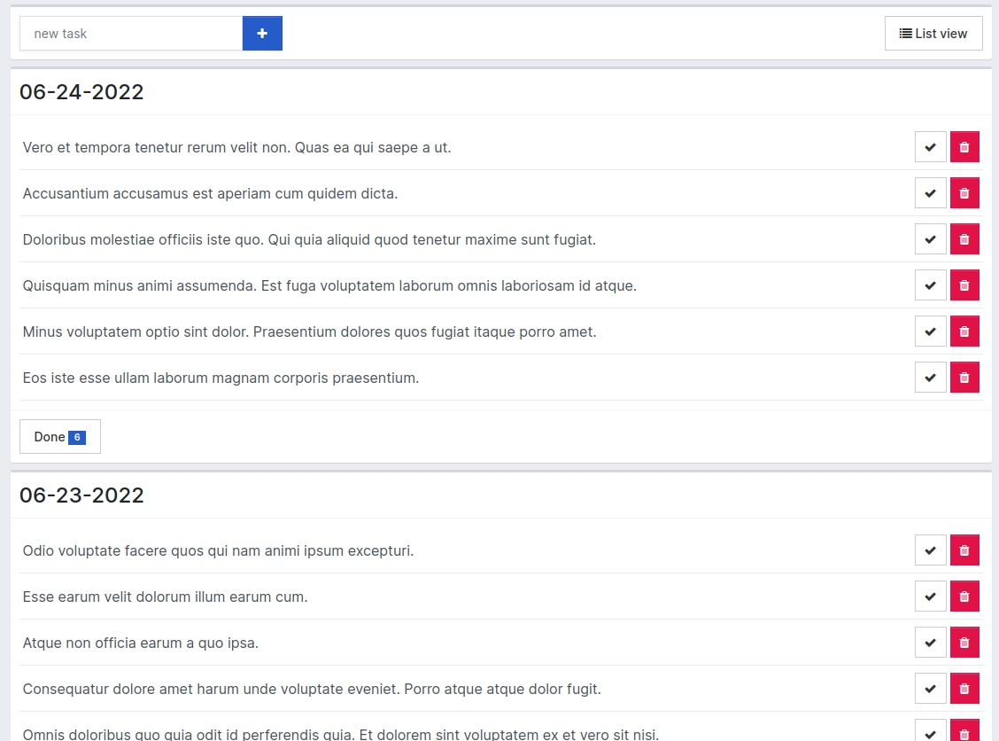

# todo
A simple "to do" tasks, using laravel + vuejs + inertiajs

This is a project part of my portfolio.

The main goal is to show an example of my work and how I code.

Below a raw prototype:


The final result:
[](https://vimeo.com/723834753/71aa55b963 "Final Result")

# instalation
```git cone https://github.com/jakjr/todo.git ./todo```

```cd todo```

```composer install```

```npm install```

```npm run watch```